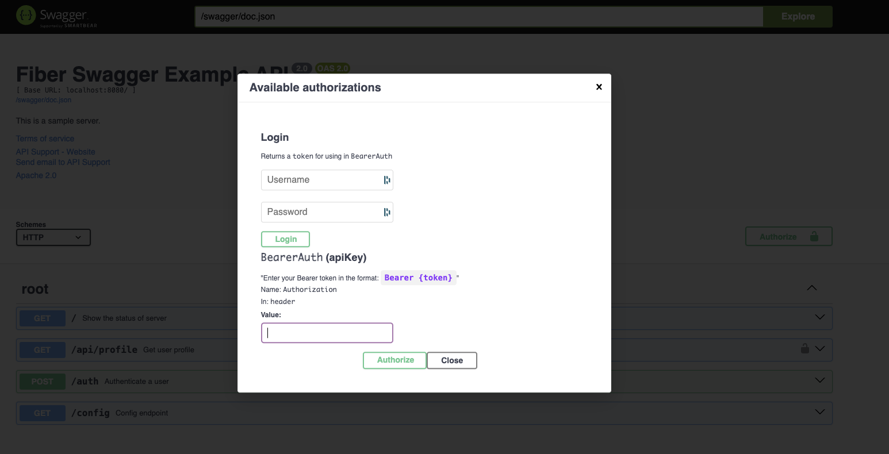

# Example using Go Swagger Auth Form Package

This is a simple example of using the go-swagger-auth-form package.

Required to use the package: github.com/schmentle/go-swagger-auth-form

## Run the app

1. Download the go module dependencies
    ```bash
    go mod download
    ```
2. Run the app
    ```bash
    go run main.go
    ```
3. Open the browser and navigate to [http://localhost:3000/swagger/index.html](http://localhost:3000/swagger/index.html)

Example screenshot of the form generated:


